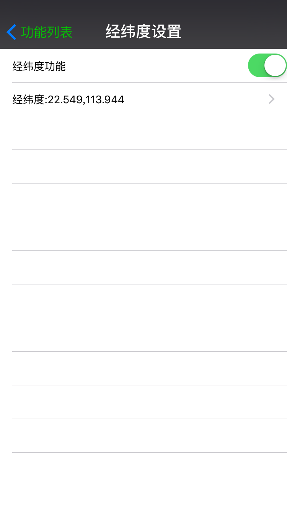

# weweChatAssitant
微信自动抢红包,微信修改经纬度

一旦安装了,打开微信,会出现一个浮动菜单  

  

点击菜单,就出现了相关的控制开关了  
   
 

抢红包设置  
    

经纬度设置  
    

运动步数设置  
  

使用方式

1、从 PP助手下载或者从一个越狱手机上砸壳后获取砸过壳的微信 (非越狱插件需要修改微信的二进制可执行文件,有壳的(appstore下载的)是无法修改的)

2、编写微信的抢红包的代码(这里就是此工程,本工程中的TestTweak.xcodeproj,只是为了使用Xcode来方便的浏览和编写代码,并没有使用它来生成dylib,是采用脚本来生成dylib的) ,cd 到 build_dylib.sh 所在目录下， 运行脚本 build_dylib.sh 就可以生成用来嵌入微信二进制的通用的动态链接库 wechatRedEnvelop.dylib

3、将1、得到的砸了壳的微信,解压缩这个ipa文件,将wechatRedEnvelop.dylib拷贝到解压后的微信的app文件夹中,和WeChat同级目录.

4、使用brew安装optool或者optool ，这个项目包含了另外的子项目，ArgumentParser，ArgumentParser又包含子项目 CoreParse，记得修改ArgumentParser中CoreParse的代码地址（ArgumentParser配置的有问题）来自己编译optool.

5、利用optool来修改微信的可执行文件WeChat,注意,是不含后缀的那个文件

optool install -c load -p "@executable_path/wechatRedEnvelop.dylib" -t WeChat.app/WeChat
这里的@executable_path表示的是可执行文件所在的目录,这也就是为什么3、中将将wechatRedEnvelop.dylib拷贝其解压后的微信的app文件夹中,和WeChat同级目录的原因.

（记得 @executable_path 不能缺少,也不要改成其他的,这是一个预定义的宏,在实际执行的时候,会转换为可执行文件所在的目录.）

6、使用企业版账号随便archive一个应用,将其中的embedded.mobileprovision文件拷贝出来,放到微信文件夹下,和WeChat同级目录,一定要记得 需要这个 embedded.mobileprovision 文件,如果没有这个文件,重签名后是安装不了的

7、重签名 这一步可以使用图形化工具 [ios-app-signer](https://github.com/DanTheMan827/ios-app-signer) 得到新的ipa安装包

8、利用iTool Pro或者PP助手等,安装制作好的ipa即可!

> 重签名后使用iTools Pro来安装,出现错误提示  WatchKitAppBundleDNotPrefixed
 这个是由于这个app中不止一个可运行的程序,还有watch os的,由于我们这里不需要watch os,所以可以直接将文件夹 watch删掉 (其中有WeChatWatchNative.app)
> 再重新签名,就可以了

